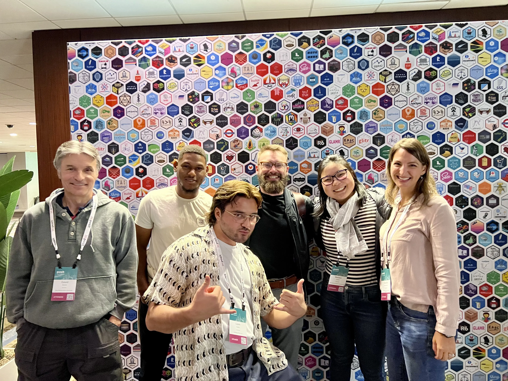
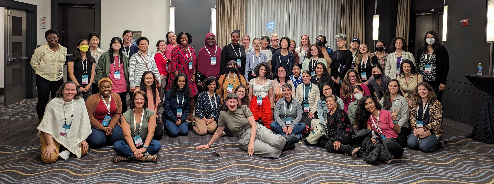
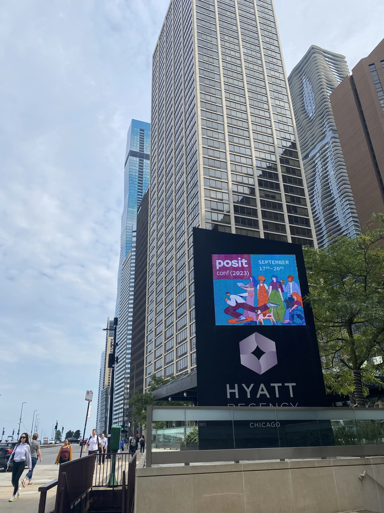

{fig-alt="A group
of six people smiling with a backdrop illustrated with hex stickers.", .preview-image}

I was honored to be an **Opportunity Scholar** on my first posit::conf ever,
which means admission tickets, hotel and flight expeses were covered by Posit.
Considering that just the admission ticket is a _lot_ of money, especially if
you come from a country with a weak currency, I would probably never even
consider attending the conference out of my own pocket (although now that I've
been to one, I'm dying to go again next year).

## So, what happened at posit::conf?

I was (quite literally) speechless for most of the event (more on that later).
It was so inspiring to see other Opportunity Scholars giving talks, sharing
meals with fellow R nerds, and talking about everything that R allows us to do,
from awesome presentations to great dataviz and reproducible modeling. It was
also so nice to find common interests with various people outside of strictly
professional topics.

I don't think I'll be able to summarize all 4 days, but here goes nothing. The
following is a short list of my personal highlights of the conference. If you
want to have an overall view of Posit's announcements, head over to Posit's blog
post where they listed their [five takeaways from
posit::conf(2023)](https://posit.co/blog/five-takeaways-from-posit-conf-2023/), 

### 1. Quarto, quarto and more quarto

So many things are happening with Quarto! I'm especially excited to try out
**typst**, which promises to be friendlier than LaTeX. I also finally started
this blog and website, which had been in my plans for years.

### 2. DevOps for data scientists

DevOps was my choice for the first two days of workshops. It's a shame that,
because it was a two-day workshop, that meant I couldn't do two different
workshops, but I regret nothing. I learned so much (who's intimidated by Docker
now?? Not me, that's for sure. Well, maybe just a little bit, but hey, baby
steps), and once I got home, the project I was working on during the workshop
evolved into this website. I bought the domain a few months back, and this was
the push I needed to actually do something with it.

### 3. R-Ladies are awesome

{fig-alt="A big group
of people sitting and standing after the R-Ladies meetup."}

I'm part of the local chapter of R-Ladies in Sao Paulo but had little to no
interaction with the global team. The R-Ladies meetup on the last day was a
great opportunity to better understand the workings of the organization and be
inspired by awesome people who do such important work within the R community.
More details of the meetup are available at [this blog
post](https://rladies.org/news/2023-10-09-positconf-chicago-meetup/).

### 4. The Discord server

Being in a place with hundreds of people can be a little overwhelming. I found
that the posit::conf Discord server was a great way to start a conversation
(kudos for the foodie channel!) in a more controlled environment -- while also
keeping track of sticker drops!

## Tips and hot takes

There are also a few things that I wanted to share with other people planning to
attend next year.

### 1. If you're an introvert, know that there are others like you

Yes, you, the person standing awkwardly in a corner while everyone else is
mingling and seems to be having a great time. There are other people doing
exactly the same. Try to approach them with some questions, maybe? Here are some
basic conversation starters once you're past the "what do you do for work"
stage that are not _too_ boring but also not too unrealistic:

- What talks did you like the most so far?
- What did you learn that you are excited to try?
- What's your favorite R package?
- What is the R community like where you're based?
- Is it your first time in {city}? Do you have any plans apart from the conf?

### 2. Don't assume people know the same things you do

Talking to people who are very knowledgeable can be either intimidating or
mind-opening. I had a great time talking to a much more experienced developer
who explained so much about their project in a friendly way that I felt welcomed
to share my thoughts and ask questions. Be mindful not to be the arrogant person
(even if unconsciously) who assumes people know what you're talking about.

### 3. It's OK to take a break

By the end of the second day, I was physically and mentally exhausted. To be
honest, I was recovering from a cold a few days before my flight, and was
feeling great, but two days of talking non-stop, some alcohol and early mornings
made me so hoarse I could barely hear myself speak. 

So I decided to skip some talks (that I knew would be recorded anyway, so I
could catch up later) and rested. During one of my breaks, I had a lovely time
making friendship bracelets at the arts and crafts table with other people who
were recharging their social batteries. I'm also not much of a morning person,
so I purposefully missed breakfast on the last day to have tea and some quiet
time by myself outside the hotel.

{fig-alt="posit conf logo at
the entrance of the hyatt hotel."}

It was absolutely amazing to attend posit::conf(2023). Next year it's going to
be in Seattle and I'm already thinking about _how_ I'm going to be there.
Fingers crossed for getting a talk acceppted! 🤞
