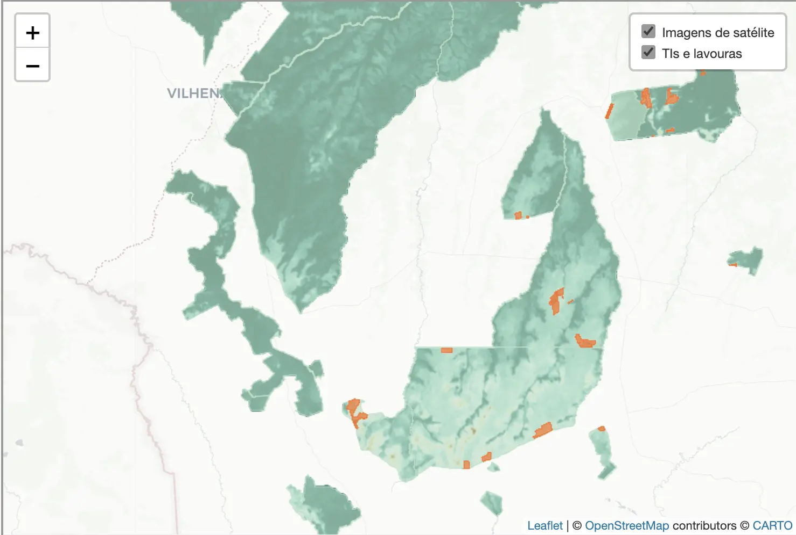

{.preview-image}

A study commissioned by news outlet O Joio e o Trigo revealed that the
state of Mato Grosso, an agricultural powerhouse, hosts approximately 73,000
hectares of mechanized plantations within its indigenous lands. 

The research, conducted by geographer Felipe Sodré and geologist Dr. Natalie
Aubet, employed satellite imagery from January 2021 to May 2023, utilizing
advanced segmentation techniques for accurate mapping. Of the 72 indigenous
territories in the state, 21 were found to contain commodity crops, raising
concerns about leases, invasions, and ongoing legal disputes. This unprecedented
insight into the intersection of agriculture and indigenous lands underscores
the complex dynamics at play in Mato Grosso.

The interactive maps featured in the story were made by me with Leaflet from the
original data provided by the researchers.

_Read more [here](https://ojoioeotrigo.com.br/2023/07/mato-grosso-tem-lavoura-mecanizada-dentro-de-terras-indigenas/)._
