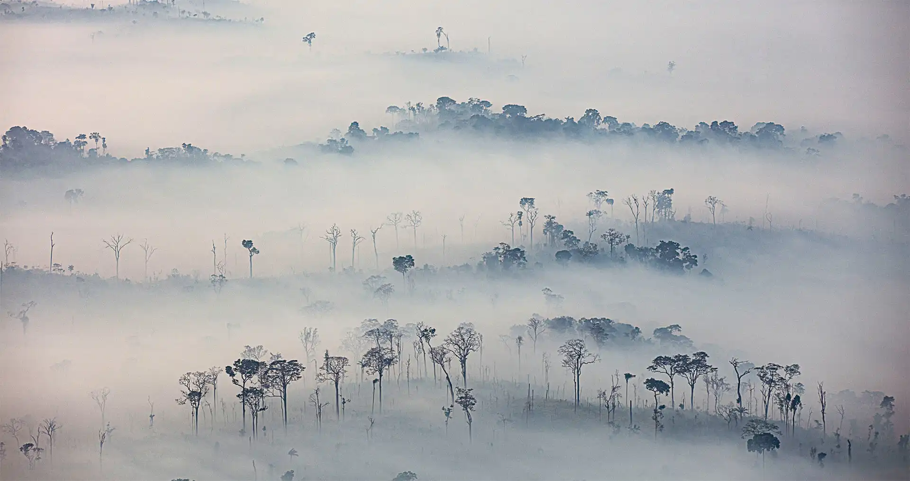

{fig-alt="SMOKE
IN THE TAPAJÓS NATIONAL FOREST, AMAZON REGION OF PARÁ STATE, SEPTEMBER 2020"
.preview-image}

Inhaling Smoke is a special project that investigates the effects of air
pollution caused by wildfires on the health of the Brazilian Amazon population
during the pandemic.

In 2020, the tragic combination of the Covid-19 pandemic and one of the most
severe cycles of fires and deforestation in the Brazilian Amazon meant that
residents of fire-affected regions were also more exposed to the risk of
Covid-19 worsening. Breathing, especially in municipalities in the states of
Rondônia, Mato Grosso, Acre and Amazonas, has become more dangerous.

This toxic synergy was the object of an unprecedented data analysis carried out
by a multidisciplinary team of journalists, geographers, statisticians from
InfoAmazonia, in partnership with researchers from LabGama, from the Federal
University of Acre, and Fiocruz’s Climate and Health Observatory/ICICT. The
project was supported by Stanford University through the Big Local News program,
which aims to open up data in formats that can be replicated by journalists
around the world.

_Learn more about this project
[here](https://infoamazonia.org/en/project/inhaling-smoke/)._